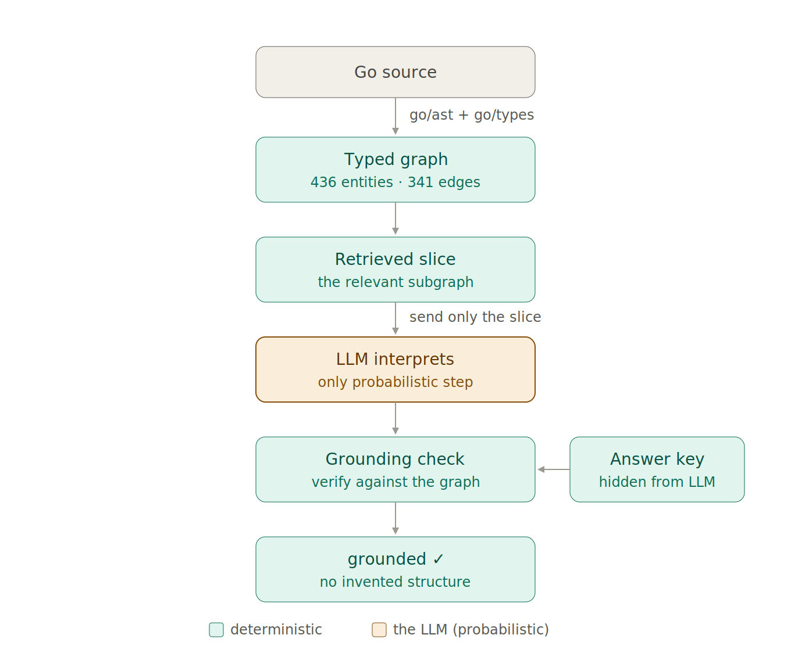

# raft-graph

> A structurally-grounded knowledge graph over the [etcd/raft](https://github.com/etcd-io/raft) codebase. The compiler builds the graph; an LLM only *interprets* it — and every claim it makes is checked back against the graph.

Most GraphRAG uses a language model to **extract** the graph: it reads code (or text), guesses the entities and relationships, and stores the result as ground truth. That graph is the model's guesswork, and every downstream answer inherits its hallucinations.

This project inverts that. For a codebase, the structure isn't ambiguous — a compiler already knows exactly what types exist, what methods hang off them, and what implements what. So the extraction is **deterministic** (Go's `go/ast` + `go/types`), and the LLM is allowed only to **interpret** a retrieved slice of real entities, never to add to the graph. A verification step then checks the model's answer against the graph: every cited entity must exist, and every implementation mapping must match the compiler.

The one-line version: **the LLM interprets, but never invents, the graph.**

## The pipeline



Every step is deterministic and compiler-checked except one — the LLM. Everything around that step exists to fence it in.

1. **Extract** — walk the Go package's AST and type system, emit a typed graph (entities + relations), each tagged with `file:line` provenance. No model in this layer.
2. **Retrieve** — pull the relevant subgraph (an interface, its methods, its implementing struct) out of the graph. This is the only thing the model sees.
3. **Interpret** — the LLM describes each method's contract and which implementation method fulfills it, citing exact entity IDs. It never sees the source.
4. **Verify** — the grounding check confirms every cited entity exists and every mapping matches a deterministic, compiler-computed answer key the model never sees.

## Results

Run against all three of raft's implemented interfaces, every one comes back fully grounded — zero invented entities, every interface-to-implementation mapping matching the compiler, reproduced across runs.

| Interface | Implementation | Methods | Provenance (interface / impl) | Verdict |
|---|---|---|---|---|
| `Storage` | `MemoryStorage` | 6 | `storage.go:48` / `storage.go:104` | grounded |
| `Logger` | `DefaultLogger` | 12 | `logger.go:25` / `logger.go:73` | grounded |
| `Node` | `node` | 15 | `node.go:132` / `node.go:297` | grounded |
| **Total** | | **33** | | **33 / 33** |

### Grounding is not correctness

The guarantee is deliberately narrow. The check verifies *structure* — that every cited entity is real and every mapping is the compiler's — not the *meaning* of the prose. Under a loose prompt, the model will happily recite implementation mechanics from training that aren't in the provided slice, and still pass the check. The honest claim is exactly: **the LLM cannot invent or mis-attribute structure** — not "the LLM cannot be wrong." Constraining the prompt to interpret only what the signatures support collapses that over-reach into honest "not determinable" output. See the [writeup](#writeup) for the full experiment.

## How it works

The system is two layers:

- **Layer 1 — the graph (Go).** `tools/ast_walker` walks `go.etcd.io/raft/v3` with `go/ast`, `go/types`, and `golang.org/x/tools/go/packages`, and emits `raft_graph.json`: 436 entities and 341 relations (`HAS_FIELD`, `HAS_METHOD`, `EMBEDS`, `IMPLEMENTS`), each with provenance. The `IMPLEMENTS` edges are computed by the type checker — the Go source never states them.
- **Layer 2 — interpretation + verification (Python).** A typed loader validates the graph against a Pydantic schema (`extra="forbid"`, so schema drift is an alarm), an in-memory store indexes it, a retriever assembles the interface slice, the LLM layer interprets it, and the grounding check verifies the result and renders a standalone HTML report.

## Layout

```
src/raft_graph/
  structural/      schema.py   typed Pydantic model of the graph
                   loader.py   load + validate raft_graph.json
  graph/           store.py    in-memory indices over entities/relations
  semantic/        prompts.py  system prompt + user-prompt rendering
                   extractor.py  retrieve slice, answer key, grounding check
                   llm.py      provider-agnostic completion (OpenAI / Anthropic)
                   render.py   ExperimentResult -> standalone HTML figure
                   run_storage.py  CLI entrypoint
data/
  raft_graph.json  the extracted graph (Layer 1 output, committed)
tools/
  ast_walker/      the Go extractor (Layer 1)
```

## Run it

Layer 2 runs out of the box — the extracted graph is committed, so you don't need the Go toolchain to reproduce the grounding results.

```bash
# 1. install (uses uv)
uv sync

# 2. provide an API key (.env)
echo "OPENAI_API_KEY=sk-..." > .env      # or ANTHROPIC_API_KEY=...

# 3. run the grounding check on an interface
uv run python -m raft_graph.semantic.run_storage                       # Storage (default)
uv run python -m raft_graph.semantic.run_storage go.etcd.io/raft/v3.Logger
uv run python -m raft_graph.semantic.run_storage go.etcd.io/raft/v3.Node
```

Each run prints the grounding report and writes `out/<Interface>_grounding.html` — a self-contained contract guide you can open in a browser.

The LLM layer auto-detects the provider from your environment: `OPENAI_API_KEY` uses `gpt-5.5`, `ANTHROPIC_API_KEY` uses `claude-sonnet-4-6`. Override the model as the optional third argument.

To regenerate the graph from source (Layer 1):

```bash
cd tools/ast_walker && go run .      # writes raft_graph.json; copy it to ../../data/
```

## Requirements

- Python 3.12, [uv](https://docs.astral.sh/uv/)
- An OpenAI or Anthropic API key (Layer 2)
- Go 1.21+ — only if you want to regenerate the graph (Layer 1)

## Status & roadmap

The graph is currently *static* — types, members, containment, implementation. It has no control-flow edges, so it can describe the `Storage` contract but can't yet explain how leader election works. Next: `CALLS` edges and method-body capture, which turn the static skeleton into something that can trace behavior (the election state machine).

## Writeup

The full story and the "grounding is not correctness" experiment are in the accompanying blog post on [systems-ai.hashnode.dev](https://systems-ai.hashnode.dev).